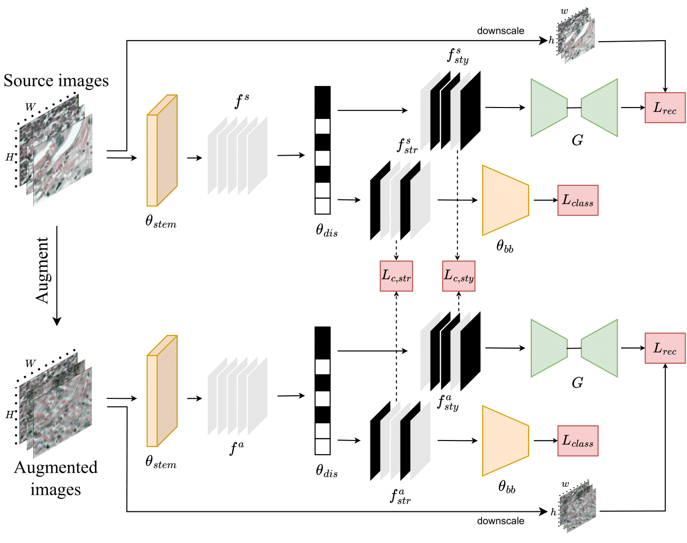

# ConDiSR
Official Repository for the paper titled ConDiSR: Contrastive Disentanglement and Style Regularization for Single Domain Generalization. [Link to the paper](https://arxiv.org/html/2403.09400v1)

# Abstract:
Medical data often exhibits distribution shifts, which cause test-time performance degradation for deep learning models trained using standard supervised learning pipelines. This challenge is addressed in the field of Domain Generalization (DG) with the sub-field of Single Domain Generalization (SDG) being specifically interesting due to the privacy- or logistics-related issues often associated with medical data. Existing disentanglement-based SDG methods heavily rely on structural information embedded in segmentation masks, however classification labels do not provide such dense information. This work introduces a novel SDG method aimed at medical image classification that leverages channel-wise contrastive disentanglement. It is further enhanced with reconstruction-based style regularization to ensure extraction of distinct style and structure feature representations. We evaluate our method on the complex task of multicenter histopathology image classification, comparing it against state-of-the-art (SOTA) SDG baselines. Results demonstrate that our method surpasses the SOTA by a margin of 1\% in average accuracy while also showing more stable performance. This study highlights the importance and challenges of exploring SDG frameworks in the context of the classification task.

<p align="center">
    
</p>

The application code we use is based on backbone codes from DomainBed[1], MIRO[2] and SWAD[3].

Install required libraries:
```
pip install -r requirements.txt
```

Run training with Camelyon17_WILDS datasets (have to be organized similarly to PACS):
```
python tools/train.py --root /dataset/path --source_domains s --target_domains t1 t2 t3 t4 --dataset-config-file ./configs/datasets/dg/cam17.yaml --config-file ./configs/trainers/dg/vanilla/adgv_cam17.yaml
```
